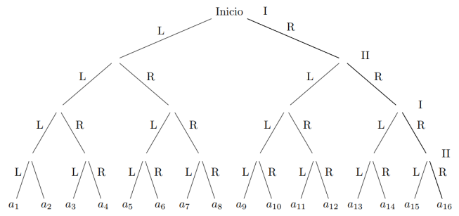

# Game Theory Workshop 2 - Part 2: Minimax Algorithm Solution

This repository contains the code to solve the second part of the "Game Theory Workshop 2" problem, where two players take turns moving left ('L') or right ('R') through a sequence of nodes. The goal is to determine the optimal sequence of moves using the minimax algorithm.

## Problem Description

In this game, players alternate moves and can either move to the left ('L') or right ('R'). The game consists of 16 terminal nodes, labeled from `a1` to `a16`. After four alternating moves, the players receive a utility in the form of `(ai, -ai)`, where `ai` is the value at the terminal node they reach. The task is to write a Python script that determines the optimal sequence of moves based on the minimax algorithm.

## Problem Visualization



### Task Requirements

1. **Part A:**
   - Write a Python script that takes a tuple of values `(ai)` for `i = 1, 2, ..., 16` as input and returns the optimal sequence of moves that the players will make using the minimax algorithm. If both moves are indifferent to a player, they should prefer moving to the left.
   
2. **Part B:**
   - Form the tuple `(ai)` based on the following rules:
     - The first 6 values represent the digits of your birthdate in `dd-mm-yy` format.
     - The next 6 values are the digits of your student ID number.
     - If there are fewer than 16 values, fill in the remaining numbers with your favorite digits.

## Solution Overview

The solution uses a recursive minimax algorithm to simulate the game and determine the best sequence of moves for the players. The algorithm evaluates all possible sequences of four moves (which are represented by strings of 'L' and 'R') and selects the one that maximizes the value for the first player and minimizes it for the second player. The players alternate between maximizing and minimizing, with the assumption that they both play optimally.

### Code Structure

1. **`generate_sequences()`**:
   - This function generates all possible move sequences of length 4 (using combinations of 'L' and 'R').

2. **`minmax(depth, sequence, maximizingPlayer, ai, sequence_to_index)`**:
   - This function recursively computes the minimax value for a given sequence of moves. It keeps track of the current depth of the search tree, the sequence of moves so far, and whether the current player is the maximizing or minimizing player.
   
3. **`play_game(ai_values)`**:
   - This function accepts the tuple `ai_values` representing the terminal nodes' values and calculates the optimal sequence of moves using the minimax algorithm. It returns the best value and corresponding sequence.

### Example Runs

1. **Part A:**
   If the `ai_values` are defined as:

   ```python
   ai_values = (1, 2, 3, 4, 5, 6, 7, 8, 9, 10, 11, 12, 13, 14, 15, 16)
   ```

   The script returns the optimal sequence:

   ```
   Secuencia óptima del juego: (13, 'RLRL')
   ```

2. **Part B:**
   If the `ai_values` are based on a sample input, like:

   ```python
   ai_values = (2, 7, 0, 6, 0, 1, 2, 0, 1, 9, 1, 3, 6, 4, 3, 7)
   ```

   The script returns the optimal sequence:

   ```
   Secuencia óptima del juego: (7, 'RLRL')
   ```

## Setup and Usage

To run the code:

1. Clone this repository:

   ```bash
   git clone https://github.com/your-repository-url
   ```

2. Install Python 3.x (if not already installed).

3. Run the script:

   ```bash
   python minimax_game_theory.py
   ```

### Expected Output

The script will output the optimal sequence of moves (`RLRL`, etc.) and the corresponding utility value for the game based on the `ai_values` tuple provided.

## Notes

- The algorithm assumes that both players are playing optimally.
- The minimax algorithm evaluates all possible sequences of four moves, so the time complexity is manageable for this problem.
- The `ai_values` tuple must always have exactly 16 values.